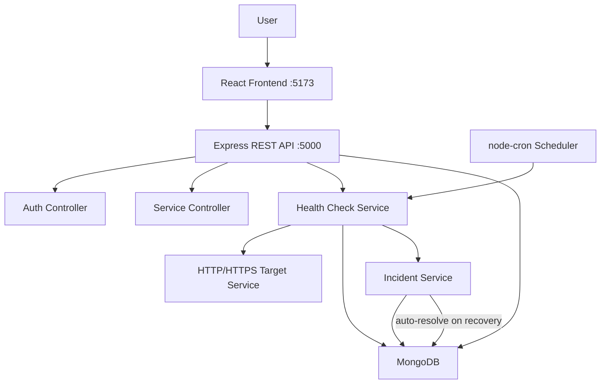

# Network Service Health Monitor

A full-stack web application that monitors the availability and performance of HTTP/HTTPS services and APIs. Built as a portfolio project to demonstrate practical software engineering skills.

---

## Problem Statement

Engineering teams often need to know whether their external APIs, third-party services, or internal endpoints are reachable and responding within acceptable times. This application provides a simple, self-hosted dashboard to monitor those services, track response times, detect failures, and raise incidents automatically when something goes wrong.

---

## Features

- **User authentication** — register, login, JWT-based sessions
- **Service management** — add, edit, delete monitored HTTP/HTTPS services
- **Manual health checks** — trigger an immediate check from the dashboard
- **Automatic monitoring** — background scheduler checks all services every N minutes (configurable)
- **Response time measurement** — records latency for every check
- **Status classification** — HEALTHY / DEGRADED / DOWN based on HTTP status and response time
- **Monitoring history** — stores up to the last 50 check results per service with a line chart
- **Uptime calculation** — `successfulChecks / totalChecks × 100`
- **Consecutive failure tracking** — counts how many checks in a row have failed
- **Automatic incident creation** — creates a HIGH-severity incident after 3 consecutive failures
- **Duplicate incident prevention** — only one OPEN incident per service at a time
- **Automatic incident resolution** — resolves open incidents when service recovers
- **Manual incident resolution** — users can resolve incidents from the Incidents page
- **Role-based access control** — USER and ADMIN roles
- **Admin panel** — admins can view all users, services, and incidents
- **SSRF protection** — blocks requests to localhost, private IPs, and link-local addresses
- **Rate limiting** — auth endpoints and manual health checks are rate limited
- **Security headers** — Helmet.js adds HTTP security headers
- **Centralized error handling** — consistent error response shape across all endpoints
- **Structured logging** — timestamps, levels, health-check events; never logs secrets

---

## Technology Stack

| Layer | Technology |
|---|---|
| Frontend | React 18, React Router v6, Tailwind CSS, Axios, Recharts |
| Backend | Node.js, Express.js |
| Database | MongoDB, Mongoose |
| Authentication | JSON Web Tokens (JWT), bcryptjs |
| Scheduler | node-cron |
| Security | Helmet, express-rate-limit, express-validator |
| Testing | Jest, Supertest |
| Dev tools | Vite, nodemon, npm |

---

## Architecture



**Request flow:**

```
Route → Controller → Service Layer → Mongoose Model → MongoDB
```

The scheduler runs independently of HTTP requests, polling all services on a configurable interval and writing results directly to MongoDB.

---

## Folder Structure

```
Network-service-health-monitor/
├── backend/
│   ├── src/
│   │   ├── config/
│   │   │   └── database.js          # MongoDB connection
│   │   ├── controllers/
│   │   │   ├── authController.js
│   │   │   ├── serviceController.js
│   │   │   ├── incidentController.js
│   │   │   └── adminController.js
│   │   ├── models/
│   │   │   ├── User.js
│   │   │   ├── Service.js
│   │   │   ├── MonitoringResult.js
│   │   │   └── Incident.js
│   │   ├── routes/
│   │   │   ├── authRoutes.js
│   │   │   ├── serviceRoutes.js
│   │   │   ├── incidentRoutes.js
│   │   │   └── adminRoutes.js
│   │   ├── middleware/
│   │   │   ├── authMiddleware.js    # JWT verification
│   │   │   ├── errorMiddleware.js   # Centralized error handling
│   │   │   ├── validationMiddleware.js
│   │   │   └── rateLimitMiddleware.js
│   │   ├── services/
│   │   │   ├── healthCheckService.js  # Core: HTTP checks + classification
│   │   │   ├── incidentService.js     # Incident creation + resolution
│   │   │   └── monitoringService.js   # Runs all checks in parallel
│   │   ├── jobs/
│   │   │   └── monitoringScheduler.js # node-cron job
│   │   ├── utils/
│   │   │   ├── logger.js
│   │   │   └── urlValidator.js      # SSRF protection
│   │   ├── app.js                   # Express app setup
│   │   └── server.js                # Entry point
│   ├── tests/
│   │   ├── auth.test.js
│   │   ├── services.test.js
│   │   ├── healthCheck.test.js
│   │   ├── incidents.test.js
│   │   └── testHelper.js
│   ├── .env.example
│   └── package.json
│
├── frontend/
│   ├── src/
│   │   ├── components/
│   │   │   ├── Navbar.jsx
│   │   │   ├── StatusBadge.jsx
│   │   │   ├── ServiceTable.jsx
│   │   │   ├── ServiceForm.jsx
│   │   │   ├── MonitoringHistory.jsx
│   │   │   ├── IncidentTable.jsx
│   │   │   ├── ResponseTimeChart.jsx
│   │   │   ├── LoadingSpinner.jsx
│   │   │   ├── ErrorMessage.jsx
│   │   │   └── ProtectedRoute.jsx
│   │   ├── pages/
│   │   │   ├── Login.jsx
│   │   │   ├── Register.jsx
│   │   │   ├── Dashboard.jsx
│   │   │   ├── Services.jsx
│   │   │   ├── AddService.jsx
│   │   │   ├── EditService.jsx
│   │   │   ├── ServiceDetails.jsx
│   │   │   ├── Incidents.jsx
│   │   │   └── Profile.jsx
│   │   ├── services/
│   │   │   ├── api.js
│   │   │   ├── authService.js
│   │   │   ├── serviceService.js
│   │   │   └── incidentService.js
│   │   ├── context/
│   │   │   └── AuthContext.jsx
│   │   ├── App.jsx
│   │   └── main.jsx
│   ├── vite.config.js
│   └── package.json
│
├── docs/
│   └── INTERVIEW_NOTES.md
└── README.md
```

---

## Installation

### Prerequisites

- Node.js 18+ and npm
- MongoDB running locally (see MongoDB Setup below)
- Git

### Clone the repository

```bash
git clone <your-repo-url>
cd Network-service-health-monitor
```

### Backend setup

```bash
cd backend
npm install
cp .env.example .env
# Edit .env with your values (see Environment Variables below)
npm run dev
```

### Frontend setup

```bash
cd frontend
npm install
npm run dev
```

Open [http://localhost:5173](http://localhost:5173) in your browser.

---

## MongoDB Setup

1. Download and install [MongoDB Community Edition](https://www.mongodb.com/try/download/community) for your OS.

2. Start the MongoDB service:

   **Windows:**
   ```
   net start MongoDB
   ```
   Or open the Services panel and start "MongoDB".

   **macOS (Homebrew):**
   ```bash
   brew services start mongodb-community
   ```

   **Linux:**
   ```bash
   sudo systemctl start mongod
   ```

3. Verify it's running:
   ```bash
   mongosh
   ```
   You should see a `>` prompt. Type `exit` to quit.

4. Set `MONGODB_URI=mongodb://localhost:27017/network-health-monitor` in your `.env` file.

No manual schema creation is needed — Mongoose creates collections automatically on first use.

---

## Environment Variables

Create `backend/.env` by copying `backend/.env.example`:

```env
PORT=5000
MONGODB_URI=mongodb://localhost:27017/network-health-monitor
JWT_SECRET=replace_with_a_long_random_string
JWT_EXPIRES_IN=1d
MONITOR_INTERVAL_MINUTES=5
HEALTH_CHECK_TIMEOUT_MS=5000
SLOW_RESPONSE_THRESHOLD_MS=2000
NODE_ENV=development
```

| Variable | Description | Default |
|---|---|---|
| `PORT` | Express server port | `5000` |
| `MONGODB_URI` | MongoDB connection string | — |
| `JWT_SECRET` | Secret used to sign JWTs — keep this private | — |
| `JWT_EXPIRES_IN` | JWT expiry duration | `1d` |
| `MONITOR_INTERVAL_MINUTES` | How often the scheduler runs health checks | `5` |
| `HEALTH_CHECK_TIMEOUT_MS` | Max wait time per health check request | `5000` |
| `SLOW_RESPONSE_THRESHOLD_MS` | Response time above this triggers DEGRADED | `2000` |
| `NODE_ENV` | `development` or `production` | `development` |

**Never commit a real `.env` file.** It is in `.gitignore`.

---

## API Endpoints

### Authentication

| Method | Endpoint | Auth | Description |
|---|---|---|---|
| POST | `/api/auth/register` | None | Create a new account |
| POST | `/api/auth/login` | None | Login, receive JWT |
| GET | `/api/auth/me` | Bearer | Get current user profile |

### Services

| Method | Endpoint | Auth | Description |
|---|---|---|---|
| GET | `/api/services` | Bearer | List your services |
| POST | `/api/services` | Bearer | Add a new service |
| GET | `/api/services/:id` | Bearer | Get service details + history |
| PUT | `/api/services/:id` | Bearer | Update a service |
| DELETE | `/api/services/:id` | Bearer | Delete service + all data |
| POST | `/api/services/:id/check` | Bearer | Trigger manual health check |
| GET | `/api/services/:id/monitoring` | Bearer | Get monitoring history |

### Incidents

| Method | Endpoint | Auth | Description |
|---|---|---|---|
| GET | `/api/incidents` | Bearer | List your incidents |
| GET | `/api/incidents/:id` | Bearer | Get one incident |
| PATCH | `/api/incidents/:id/resolve` | Bearer | Manually resolve an incident |

### Admin

| Method | Endpoint | Auth | Description |
|---|---|---|---|
| GET | `/api/admin/users` | Admin | List all users |
| GET | `/api/admin/services` | Admin | List all services |
| GET | `/api/admin/incidents` | Admin | List all incidents + stats |

---

## Authentication

The app uses **JWT (JSON Web Tokens)**:

1. On login/register, the server signs a JWT with `JWT_SECRET` and returns it to the client.
2. The client stores it in `localStorage` and sends it as `Authorization: Bearer <token>` on every request.
3. The `protect` middleware verifies the token and attaches `req.user` to the request.
4. Passwords are hashed with bcrypt (12 salt rounds) before storage — plaintext passwords are never stored.

---

## Health Check Logic

For every check the system:

1. Validates the URL (SSRF protection)
2. Starts a timer
3. Sends `GET` request with a 5-second timeout via Axios
4. Stops the timer — this is the `responseTime`
5. Classifies status:

```
HTTP 200–399 + response time ≤ 2000ms  →  HEALTHY
HTTP 200–399 + response time > 2000ms  →  DEGRADED
HTTP 500–599                            →  DOWN
Timeout / DNS error / connection refused →  DOWN
HTTP 4xx (e.g. 404)                     →  HEALTHY (server responded, resource missing)
```

6. Saves a `MonitoringResult` document
7. Updates service statistics (`totalChecks`, `successfulChecks`, `consecutiveFailures`, etc.)
8. Passes result to incident service

**Key insight on 4xx:** A 404 means the server was reachable — TCP connection succeeded, HTTP response was received. Only the specific resource was not found. The service itself is healthy at the network level. We store the HTTP status code separately so users can still see it.

---

## Incident Detection Logic

```
Check 1: DOWN  →  consecutiveFailures = 1  →  no incident
Check 2: DOWN  →  consecutiveFailures = 2  →  no incident
Check 3: DOWN  →  consecutiveFailures = 3  →  CREATE incident (HIGH severity)
Check 4: DOWN  →  consecutiveFailures = 4  →  update failureCount, no new incident
Check 5: UP    →  consecutiveFailures = 0  →  AUTO-RESOLVE open incident
```

Duplicate prevention: before creating an incident, we query for an existing OPEN incident on the same service. If one exists, we only update `failureCount`.

---

## Security

### SSRF Protection

Because users can enter arbitrary URLs, the backend validates every URL before making a request. Blocked targets:

- `localhost`, `127.x.x.x` — loopback
- `0.0.0.0` — unspecified
- `10.x.x.x`, `172.16-31.x.x`, `192.168.x.x` — RFC 1918 private ranges
- `169.254.x.x` — link-local (used by AWS metadata endpoint)
- `fc00::/7`, `fe80::/10` — IPv6 private/link-local
- Non-HTTP/HTTPS protocols (ftp://, file://, etc.)

**Known limitation:** This implementation blocks based on the URL hostname as written. It does not perform DNS resolution before blocking. A determined attacker could register a public domain that resolves to a private IP (DNS rebinding). In production you would resolve the hostname to an IP first and then re-check against the block list.

### Other security measures

- **Helmet** — sets `X-Frame-Options`, `X-Content-Type-Options`, `Strict-Transport-Security`, etc.
- **Rate limiting** — login/register: 20 req/15 min; manual checks: 10 req/min; general API: 300 req/15 min
- **Input validation** — all endpoints use express-validator; invalid input returns 422
- **Ownership checks** — every service/incident endpoint verifies the requesting user owns the resource
- **Error handling** — stack traces and internal errors are never sent to the client
- **JWT** — passwords are never included in the token payload

---

## Testing

```bash
cd backend
npm test
```

**Test suites:** 4  
**Total tests:** 59

| Suite | Tests |
|---|---|
| `auth.test.js` | Registration, login, JWT, duplicate email, invalid inputs |
| `services.test.js` | CRUD operations, ownership, SSRF validation |
| `healthCheck.test.js` | Status classification, URL validation, private IP blocking |
| `incidents.test.js` | Consecutive failure logic, incident creation, duplicate prevention, resolution |

---

## Test Scenarios

| Scenario | Expected Result |
|---|---|
| Valid service, HTTP 200, fast response | HEALTHY |
| HTTP 200, response > 2000ms | DEGRADED |
| HTTP 404 | HEALTHY (server responded) |
| HTTP 500 | DOWN |
| Request timeout | DOWN |
| 1st consecutive failure | No incident |
| 2nd consecutive failure | No incident |
| 3rd consecutive failure | Incident created (HIGH) |
| 4th+ failure (incident open) | failureCount updated, no duplicate |
| Recovery after failures | consecutiveFailures reset, incident auto-resolved |
| No JWT token | 401 Unauthorized |
| Invalid JWT | 401 Unauthorized |
| Valid JWT, wrong user's service | 403 Forbidden |
| localhost URL | 400 INVALID_URL |
| Private IP URL (192.168.x.x) | 400 INVALID_URL |
| ftp:// protocol | 400 INVALID_URL |
| Duplicate email registration | 409 EMAIL_TAKEN |
| Weak password (< 8 chars) | 422 Validation Error |

---

## Running the Application

**Terminal 1 — Backend:**
```bash
cd backend
npm run dev
```

**Terminal 2 — Frontend:**
```bash
cd frontend
npm run dev
```

Then open [http://localhost:5173](http://localhost:5173).

Register an account, add a service (e.g. `https://www.google.com`), and click **Check Now** to see a live result.

---

## Future Improvements

- Email/webhook notifications when an incident is created
- Custom check intervals per service (instead of one global interval)
- DNS resolution before SSRF check (prevents DNS rebinding attacks)
- SSL/TLS certificate expiry monitoring
- Multi-region checks (check from multiple locations)
- User-configurable slow-response threshold per service
- Pagination for monitoring history
- Export monitoring data as CSV
- Dark/light theme toggle
